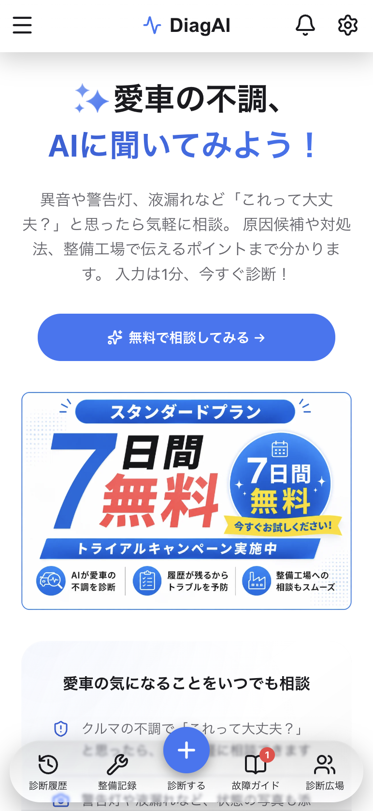
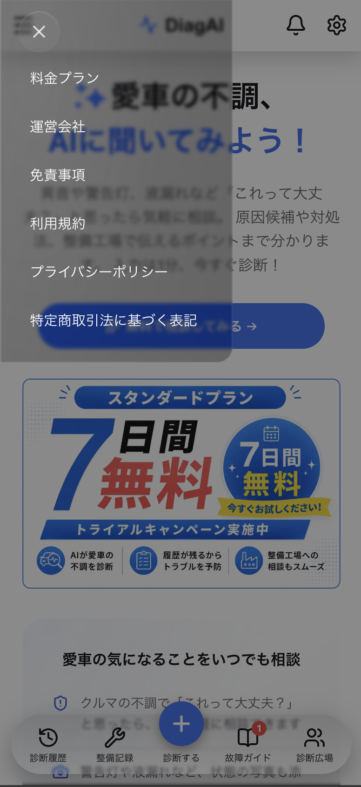

# Liquid Glass Nav

A mobile top bar, bottom tab bar, and hamburger drawer with an Apple
"Liquid Glass"-style translucent, refractive look — layered glass surfaces,
a sliding bottom-tab highlight, and a press-triggered "bloom" where the glass
visibly reacts to contact.

Screenshots below are from [DiagAI](https://diagai.jp) (an AI car-diagnosis
app), the real production app this was extracted from — the top nav, bottom
nav's sliding indicator, and the hamburger drawer with the same glass
treatment:

<p>
  
  
</p>

No component library, no build step required for the vanilla version — plain
CSS + JS. React components with the same behavior are included too.

## Install

This package is published to GitHub Packages:

```sh
npm install @dev-okazawa/liquid-glass-nav --registry=https://npm.pkg.github.com
```

Import the React components and shared CSS:

```tsx
import {
  LiquidGlassBottomNav,
  LiquidGlassHamburgerMenu,
  LiquidGlassTopNav,
} from '@dev-okazawa/liquid-glass-nav'
import '@dev-okazawa/liquid-glass-nav/style.css'
```

## Used in production

- **[DiagAI](https://diagai.jp)** — an AI car-diagnosis app. Describe your
  car's symptoms and get likely causes, an urgency read, and talking points
  to bring to a mechanic. This nav is extracted directly from its top bar,
  bottom tab bar, and hamburger menu (see the screenshots above). It's a
  mobile-first app — open it on your phone, or switch to mobile/device mode
  in desktop Chrome/Safari DevTools, to see the nav in context.

## Why this exists

True iOS Liquid Glass uses native, real-time light refraction (Metal /
Core Animation) that the web can't replicate. This approximates the *feel*
with layered `backdrop-filter`, gradients, and — where the browser actually
supports it — an SVG `feDisplacementMap` refraction filter applied through
`backdrop-filter` itself. It won't look identical to the native asset, but
it's a reasonable approximation that degrades gracefully.

## Live demo

Open `vanilla/index.html` directly in a browser, or serve the folder:

```sh
python3 -m http.server 8000
# then open http://localhost:8000/vanilla/
```

Best viewed on an actual phone (or a narrow browser viewport) — these are
mobile navigation patterns.

## What's in here

```
style.css                       — shared by both versions below
vanilla/index.html + script.js  — framework-free version
react/                          — React version (same CSS, same behavior)
  LiquidGlassTopNav.tsx
  LiquidGlassBottomNav.tsx
  LiquidGlassHamburgerMenu.tsx
```

### React usage

```tsx
import LiquidGlassBottomNav from './react/LiquidGlassBottomNav'
import LiquidGlassHamburgerMenu from './react/LiquidGlassHamburgerMenu'
import LiquidGlassTopNav from './react/LiquidGlassTopNav'

<LiquidGlassTopNav
  brand={
    <a href="/" className="topnav-brand">
      <BrandMarkIcon className="topnav-brand-mark" />
      DiagAI
    </a>
  }
  left={
    <button type="button" className="hamburger-trigger" aria-label="Open menu">
      <MenuIcon />
    </button>
  }
  right={
    <>
      <a href="/notifications" className="topnav-icon-link" aria-label="Notifications">
        <BellIcon />
      </a>
      <a href="/settings" className="topnav-icon-link" aria-label="Settings">
        <SettingsIcon />
      </a>
    </>
  }
/>

<LiquidGlassBottomNav
  tabs={[
    { key: 'home', href: '/', label: 'Home', icon: <HomeIcon /> },
    { key: 'saved', href: '/saved', label: 'Saved', icon: <BookmarkIcon /> },
    { key: 'explore', href: '/explore', label: 'Explore', icon: <CompassIcon /> },
    { key: 'profile', href: '/profile', label: 'Profile', icon: <UserIcon /> },
  ]}
  fab={{ href: '/new', label: 'Add', icon: <PlusIcon /> }}
  activeKey={activeKey}
  onNavigate={(key) => navigate(key)}
/>

<LiquidGlassHamburgerMenu
  open={drawerOpen}
  onClose={() => setDrawerOpen(false)}
  links={[
    { href: '/', label: 'Home' },
    { href: '/about', label: 'About' },
  ]}
/>
```

Wire `onNavigate`/`href` up to your router of choice — the components don't
assume one.

## How the glass effect is built

Each surface (the top bar, tab bar pill, drawer, and sliding indicator) is
three stacked layers rather than one background:

1. **effect** — the blurred backdrop (`backdrop-filter: blur() saturate()`)
2. **tint** — the material's own faint gradient, so it doesn't read as plain
   blurred glass
3. **shine** — inset box-shadows that catch light at the edges

The sliding indicator additionally has its own `::before`/`::after`
highlight/rim-light pseudo-elements that fade in only on press, and its
position/width are measured in JS (`getBoundingClientRect`) and applied via
inline `transform`/`width` — flex-based tab widths can't be expressed as a
static CSS value.

### Known browser gotchas (learned the hard way)

- **Never combine a custom `filter` with `backdrop-filter` on the same
  element.** It silently drops `backdrop-filter` entirely on Safari/iOS —
  the surface renders fully transparent, with no console warning. If you
  want an SVG displacement/refraction effect *and* a blurred backdrop, put
  the filter reference **inside** the `backdrop-filter` value itself
  (`backdrop-filter: url(#my-filter) blur(2px)`), and gate it behind
  `@supports (backdrop-filter: url("#my-filter"))` — only Chromium
  currently supports this, so unsupported browsers keep the plain
  `blur()` you declare above the `@supports` block.
- **`:active` is unreliable for the press-bloom on iOS Safari** without a
  `touchstart` listener present elsewhere on the page. Pointer events
  (`pointerdown`/`pointerup`/`pointercancel`/`pointerleave`) work
  consistently and let one shared state drive bloom on two different
  elements (the bar and the indicator) at once.
- **A long-press on a tab link triggers iOS Safari's link-preview context
  menu** ("Open / Add to Reading List / Copy Link / Share…") unless you set
  `-webkit-tap-highlight-color: transparent` is not enough by itself —
  add `-webkit-touch-callout: none` to the tab links too.
- **`max-height: 100%` (or `100vh`/`100dvh`) on a `position: fixed` drawer
  resolves differently between a regular browser tab and an installed PWA's
  standalone display-mode** (no browser chrome changes what "the viewport"
  means for a fixed element's containing block). `height: max-content` was
  tried as a fix and made things worse (collapsed to nothing in standalone
  mode on one device tested). What actually worked: a plain fixed pixel
  value, tuned per display-mode via `@media (display-mode: standalone)` if
  needed. See the comment on `.hamburger-drawer` in `style.css`.

## License

MIT — see [LICENSE](LICENSE).
